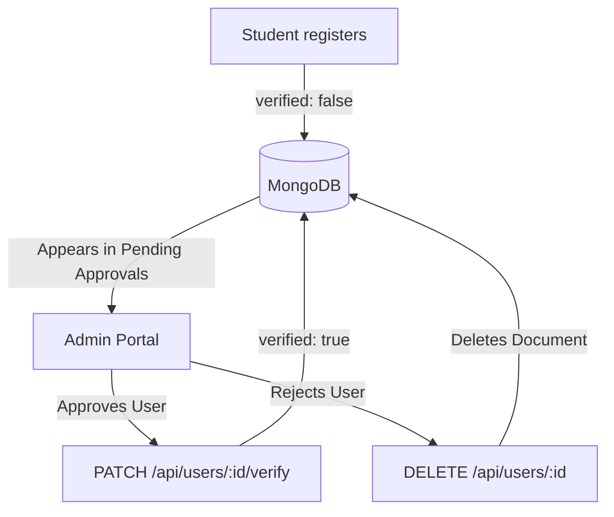

# Admin Portal & User Moderation Workflows

This document describes the administrative features, user verification flows, and moderation tools implemented in **Hostel Trade**.

---

## 1. Administrative Security

Admin features are protected by two layers of middleware:

```javascript
// routes/adminRoutes.js
router.use(protect); // Layer 1: Validates student session JWT token
router.use(isAdmin); // Layer 2: Validates if req.user.role === 'admin'
```
Administrative operations are routed through `/api/users`.

---

## 2. Admin Portal Views (`frontend/src/Admin/`)

The admin portal is restricted to users with `role: "admin"`, and includes the following layouts and pages:
* **`AdminLayout.jsx`**: Provides the layout structure, rendering a sidebar navigation alongside page outlets.
* **`AdminSidebar.jsx`**: Side navigation menu linking to the dashboard, user management, and product listings.
* **`AdminDashboard.jsx`**: Shows platform stats, including the total number of users, product listings, and pending user approvals.
* **`UserManagement.jsx`**: Controls student account approvals, edits, role changes, and deletions.
* **`AdminProductManagement.jsx`**: Lists all products published on the platform, allowing admins to moderate and delete listings.

---

## 3. Administrative Workflows



### 1. User Approvals
- **Listing Pending Users**:
  The user management page queries `GET /api/users`. The controller returns all users registered with the `student` role:
  ```javascript
  const users = await User.find({ role: 'student' });
  ```
- **Approving a User**:
  Admins can click the approve button to send a request to `PATCH /api/users/:id/verify`. This controller sets the user's `verified` field to `true`, granting them login access:
  ```javascript
  user.verified = true;
  await user.save();
  ```
- **Rejecting a User**:
  Admins can click the reject button to send a request to `DELETE /api/users/:id`. This deletes the user's document from the database.

---

### 2. User Accounts Management
- **Editing Student Details**:
  Admins can update a student's name, email, or hostel location:
  * **Route**: `PUT /api/users/:id`
  * **Logic**: Updates the user's fields and returns the updated user document to keep the admin UI in sync.
- **Toggling Admin Roles**:
  Admins can toggle a user's role between student and admin:
  * **Route**: `PATCH /api/users/:id/make-admin`
  * **Logic**:
    ```javascript
    user.role = user.role === 'admin' ? 'student' : 'admin';
    await user.save();
    ```

---

### 3. Setup and Initialization
To simplify setting up the database in non-production environments, special routes are exposed in `authRoutes.js` (only active when `process.env.NODE_ENV !== 'production'`):
- **`/api/auth/create-admin`**: If no user with the role `admin` exists in the database, this route creates the initial administrator account:
  * **Email**: `admin@campuscart.com`
  * **Password**: `admin123`
  * **Role**: `admin`
  * **Verified**: `true`
- **`/api/auth/check-admin`**: Checks if the administrator account exists.
- **`/api/auth/reset-admin`**: Resets the administrator's password back to the default `admin123`.
