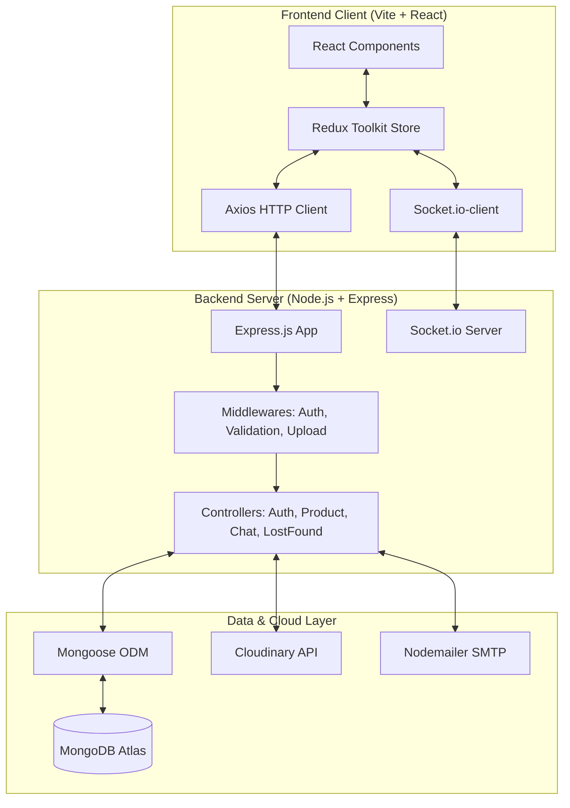
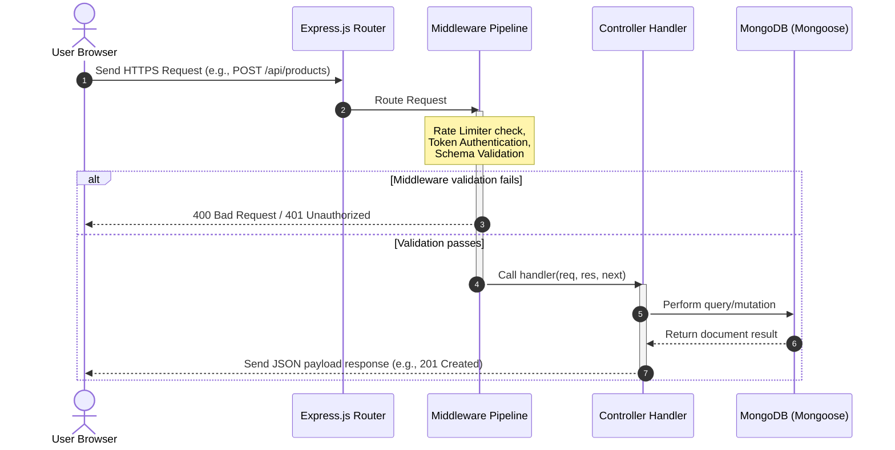
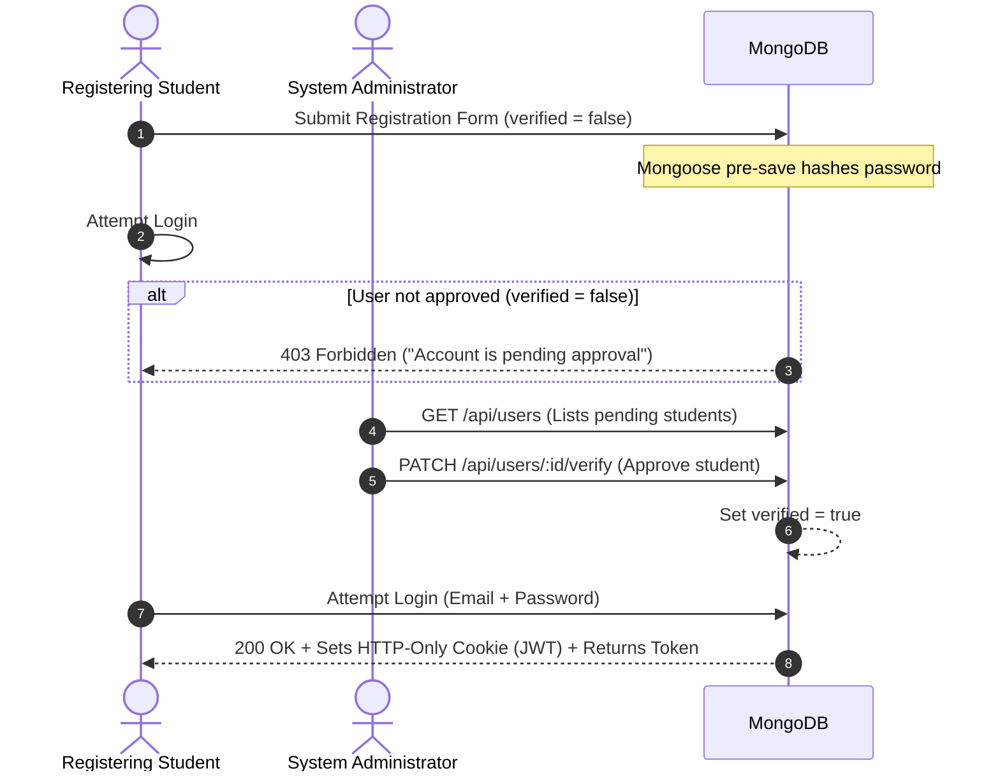
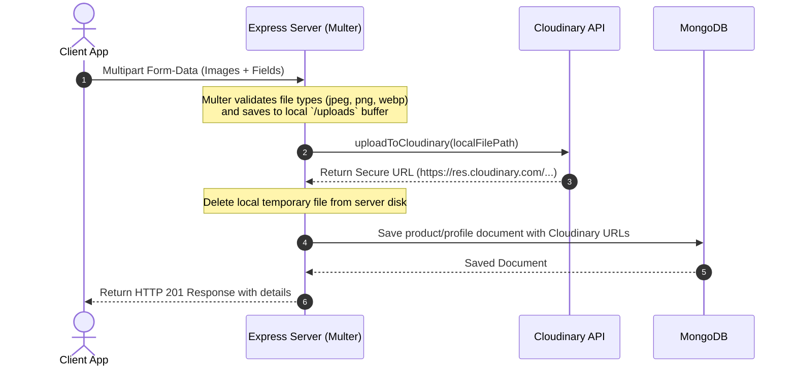
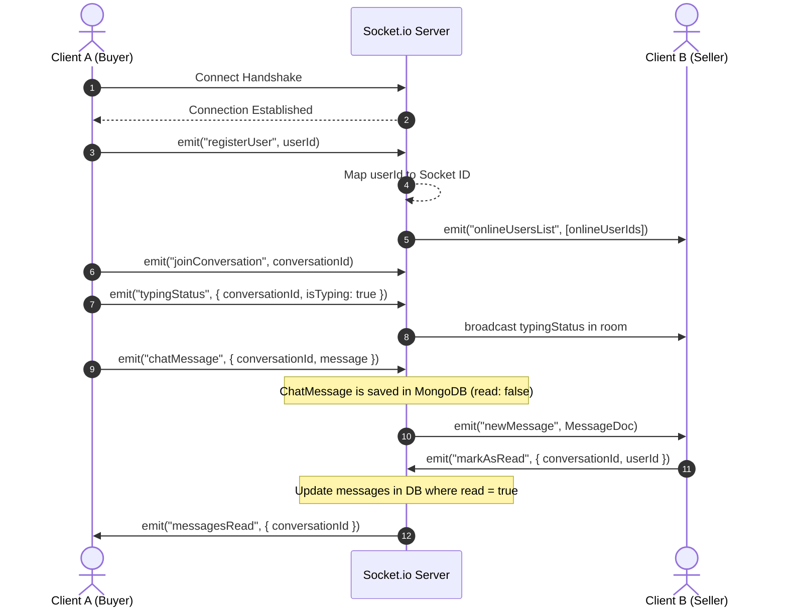

# System Architecture & Project Overview

This document provides a comprehensive overview of the system architecture, design decisions, and high-level workflows for the **Hostel Trade** (internally referenced as *CampusCart*) peer-to-peer trading application.

---

## 1. Project Overview

### Problem Statement
On university campuses and hostel complexes, students frequently need to buy, sell, or rent items (electronics, books, appliances, vehicles) and report lost or found items. Existing platforms like eBay or Craigslist are too broad, carry security risks from external parties, and lack localized hostel-level filtering.

### Motivation
To build a closed-loop, secure, and authenticated campus-only marketplace that facilitates direct transactions within student housing. Restricting accessibility to approved hostel residents minimizes security risks, fraud, and logistical overhead.

### Objectives
1. **Hostel-Restricted Access**: Implement an admin verification system to approve student registrations before they can transact.
2. **Double-Sided Marketplace**: Allow students to list items for buy/rent and manage their listings.
3. **Lost & Found Registry**: Provide a centralized directory for lost/found items with localized location/hostel details.
4. **Real-time Negotiation**: Facilitate instant messaging between buyers and sellers to negotiate without disclosing personal phone numbers.
5. **Secure Asset Hosting**: Provide secure image uploads for product and profile avatars.

### Folder Structure

The project follows a clean separation of concerns in a monorepo format:

```text
Hostel-trade/
├── backend/
│   ├── config/             # DB connection configuration
│   ├── controllers/        # Express request controllers (Business Logic)
│   ├── middleware/         # Auth, validation, file upload, error handlers
│   ├── models/             # Mongoose schemas (User, Product, LostFound, etc.)
│   ├── routes/             # REST API endpoint declarations
│   ├── uploads/            # Temporary disk storage for uploads (dev fallback)
│   ├── utils/              # Email, Cloudinary wrappers, regex sanitization
│   └── server.js           # Express entrypoint & Socket.io server
├── frontend/
│   ├── public/             # Static public assets
│   ├── src/
│   │   ├── Admin/          # Admin portal components and layout
│   │   ├── assets/         # App assets (icons, styles)
│   │   ├── components/     # Reusable UI elements (Navbar, Cards, Chat)
│   │   ├── pages/          # Full page views (Home, Profile, Marketplace)
│   │   ├── store/          # Redux Toolkit slices, reducers, and store config
│   │   ├── utils/          # Client-side helper functions
│   │   ├── App.jsx         # App router and initialization
│   │   └── main.jsx        # React root rendering
│   ├── tailwind.config.cjs # Utility styling config
│   └── vite.config.js      # Vite build configurations
└── README.md
```

---

## 2. Software Architecture

Hostel Trade utilizes a **Client-Server Architecture** separating the frontend React SPA (Single Page Application) from the backend REST API & WebSocket server.



---

## 3. Core Workflow Diagrams

### Request-Response Lifecycle
The lifecycle for a standard HTTP request follows this sequence:



### Authentication & Registration Flow
Students must register, but cannot log in until approved by an administrator.



### Image Upload Flow
Product images and profile avatars are handled via a local disk buffer before being uploaded to Cloudinary:



### Real-Time Chat & Handshake Flow
Real-time negotiation is achieved using a dual HTTP/WebSocket approach. HTTP is used to retrieve histories, and WebSockets (Socket.io) are used for instant messaging, online presence updates, typing indicators, and read receipts.


