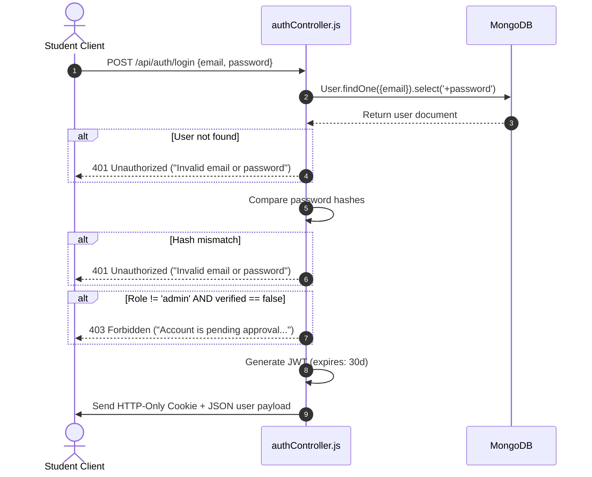
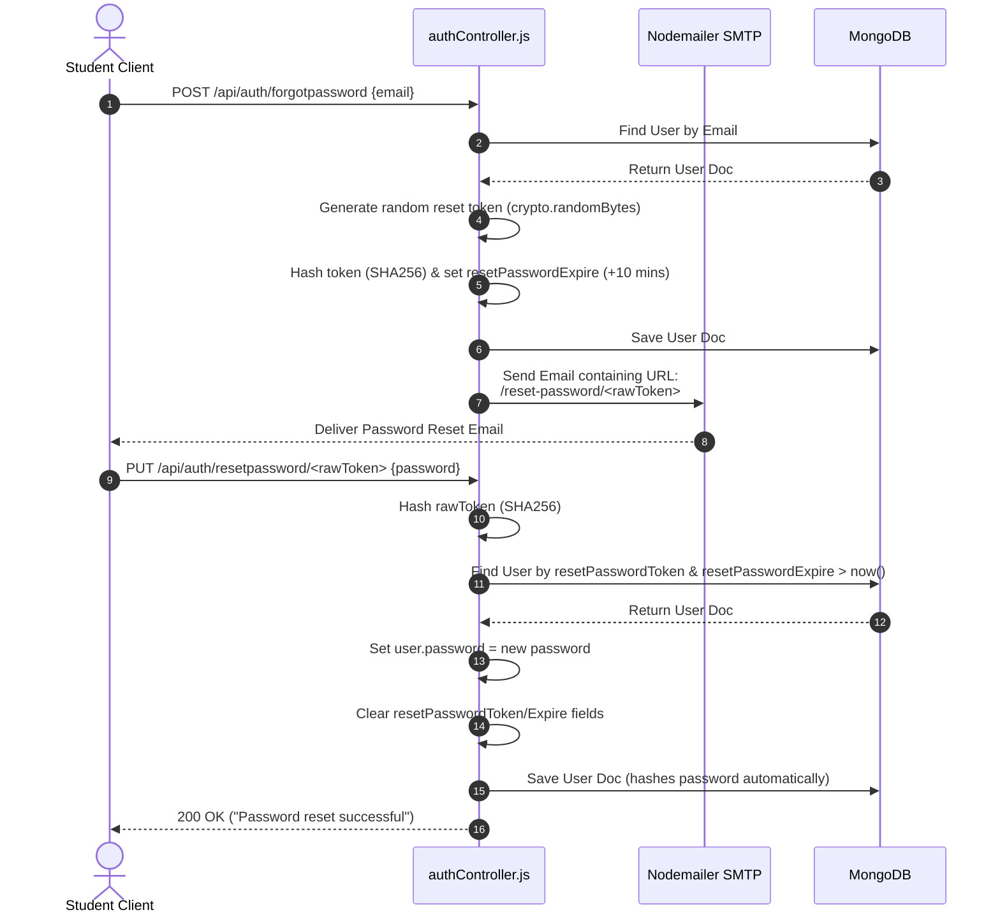

# Authentication & Authorization Flows

This document details the design, security protocols, password hashing, and user lifecycle events for identity management in **Hostel Trade**.

---

## 1. Hashing & Identity Security

### Password Hashing (`User.js`)
Hostel Trade never stores plaintext passwords.
- **Library**: `bcryptjs`
- **Salt Rounds**: `10`
- **Method**: Pre-save Mongoose hook checks if the password field is modified:
  ```javascript
  userSchema.pre('save', async function(next) {
    if (!this.isModified('password')) return next();
    const salt = await bcrypt.genSalt(10);
    this.password = await bcrypt.hash(this.password, salt);
    next();
  });
  ```
- **Comparison**: Handled via schema instance method `matchPassword(enteredPassword)` invoking `bcrypt.compare`.

### JWT Handling
- **Generation**: Signed with `jsonwebtoken` in `authController.js` (using `JWT_SECRET` and expiring in `30d`):
  ```javascript
  const token = jwt.sign({ userId: user._id }, process.env.JWT_SECRET, { expiresIn: '30d' });
  ```
- **Transmission**: Tokens are dual-transmitted to the client:
  1. Set inside an HTTP-Only cookie named `jwt` (`secure` in production, `sameSite: 'lax'`, max age 30 days).
  2. Returned directly inside the JSON response payload.
- **Verification**: The `protect` middleware checks:
  1. The `Authorization` header (`Bearer <token>`).
  2. The `jwt` cookie fallback.

---

## 2. Authentication Workflows

### Registration Workflow
1. Student submits Name, Email, Password, and Hostel.
2. Email undergoes regular expression validation to ensure correct structure.
3. System checks if email already exists in the Database. Returns `400 Bad Request` if duplicate.
4. Database document is created with `verified: false` and `role: "student"`.
5. Registration returns a success response asking the user to wait for admin approval.

### Login Workflow



---

## 3. Account Recovery (Forgot/Reset Password)

Account recovery utilizes cryptographic tokens emailed to students via Nodemailer:



---

## 4. Protected Routes & Authorization Rules

Route protection is managed at the middleware layer using Express routing pipelines:

### Private Student Access
Routes wrapped in the `protect` middleware require a valid JWT token. If valid, the user object is attached to `req.user` for subsequent controllers.

```javascript
router.get('/profile', protect, getProfile);
```

### Administrative Role Authorization
Admins must first pass the `protect` middleware, followed by the `isAdmin` validation check:

```javascript
// adminRoutes.js
router.use(protect);
router.use(isAdmin);
router.get('/', getAllUsers); // only accessible to admins
```

---

## 5. Account Deletion Workflow

Account deletion triggers a cascading cleanup to prevent orphaned records and optimize database storage:

1. System loads the authenticated user's ID (`req.user._id`).
2. Retrieves all products listed by the student (`Product.find({ user: user._id })`).
3. Iterates over listing image arrays, extracts public IDs, and calls the Cloudinary API to delete the image files.
4. Deletes all listing documents from the database (`Product.deleteMany({ user: user._id })`).
5. Checks if the student's profile picture is not the default avatar. If not, deletes the avatar file from Cloudinary.
6. Deletes all chat history involving the user (`ChatMessage.deleteMany({ $or: [{ sender: id }, { receiver: id }] })`).
7. Deletes the student user document from the database.
8. Clears the client-side `jwt` cookie.
