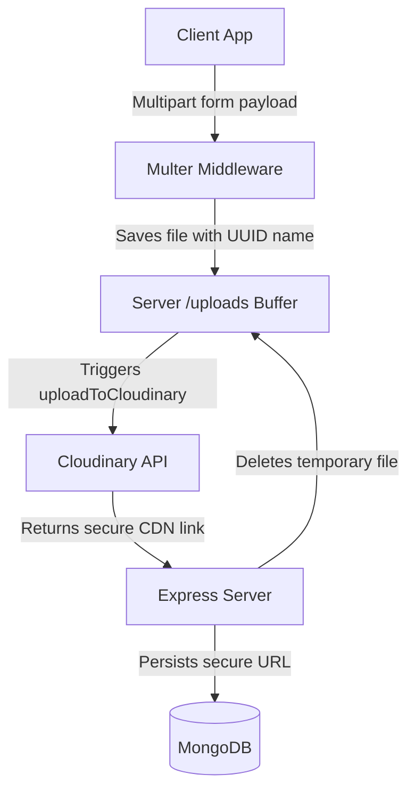

# Image Storage & Processing with Cloudinary

Hostel Trade offloads image hosting, optimization, and content delivery (CDN) to **Cloudinary**.

---

## 1. Upload Pipeline

When listing a product or updating a profile picture, images go through a structured upload pipeline:



---

## 2. File Upload Handling (`utils/cloudinary.js`)

The `uploadToCloudinary` utility uploads images to the `hostel-trade` directory on Cloudinary, and cleans up local temporary files:

```javascript
export const uploadToCloudinary = async (localFilePath) => {
  try {
    if (!localFilePath) return null;
    
    // Fallback: If configurations are missing, return local server path
    if (!process.env.CLOUDINARY_CLOUD_NAME || !process.env.CLOUDINARY_API_KEY || !process.env.CLOUDINARY_API_SECRET) {
      console.warn("Cloudinary configuration is missing. Falling back to local file path.");
      return localFilePath;
    }

    const response = await cloudinary.uploader.upload(localFilePath, {
      resource_type: "auto",
      folder: "hostel-trade",
    });
    
    // Remove temporary file from local disk buffer
    if (fs.existsSync(localFilePath)) {
      fs.unlinkSync(localFilePath);
    }
    
    return response.secure_url;
  } catch (error) {
    console.error("Cloudinary upload error:", error);
    // Cleanup local file if error occurs
    if (fs.existsSync(localFilePath)) {
      try { fs.unlinkSync(localFilePath); } catch (err) {}
    }
    throw error;
  }
};
```

---

## 3. Asset Cleanup & Deletion

To keep storage clean, when a user deletes a listing or updates their avatar, the old images are deleted from Cloudinary.

### 1. Extracting the Public ID
Cloudinary assets must be deleted using their unique Public ID, which is extracted from the secure URL:

```javascript
// URL format: https://res.cloudinary.com/cloudname/image/upload/v1234/folder/publicid.jpg
export const extractPublicId = (url) => {
  try {
    if (!url || !url.includes("cloudinary.com")) return null;
    const parts = url.split("/");
    const uploadIndex = parts.indexOf("upload");
    if (uploadIndex === -1) return null;
    
    const publicIdWithExtParts = parts.slice(uploadIndex + 2); // Skips "upload" and version strings
    const publicIdWithExt = publicIdWithExtParts.join("/");
    const lastDotIndex = publicIdWithExt.lastIndexOf(".");
    
    if (lastDotIndex === -1) return publicIdWithExt;
    return publicIdWithExt.substring(0, lastDotIndex); // Returns e.g. "folder/publicid"
  } catch (error) {
    console.error("Failed to extract public ID:", error);
    return null;
  }
};
```

### 2. Calling the Cloudinary Destroy API
The `deleteFromCloudinary` utility removes the asset from Cloudinary:

```javascript
export const deleteFromCloudinary = async (publicId) => {
  try {
    if (!publicId) return null;
    const result = await cloudinary.uploader.destroy(publicId);
    return result;
  } catch (error) {
    console.error("Cloudinary delete error:", error);
    return null;
  }
};
```

---

## 4. Local Fallback Mode
If Cloudinary environment variables are missing during local development:
* Uploaded files remain saved in the backend's `/uploads` folder.
* The file's relative path (e.g. `uploads/filename.png`) is saved in MongoDB.
* The frontend's `getImageUrl()` utility resolves relative paths using the server's URL (default: `http://localhost:5000`):
  ```javascript
  export function getImageUrl(imagePath) {
    if (!imagePath) return "/placeholder.jpg";
    if (imagePath.startsWith("http://") || imagePath.startsWith("https://")) {
      return imagePath;
    }
    const serverUrl = import.meta.env.VITE_SERVER_URL || "http://localhost:5000";
    return `${serverUrl}/${imagePath}`;
  }
  ```
This ensures developers can run and test the application locally without needing Cloudinary API credentials.
