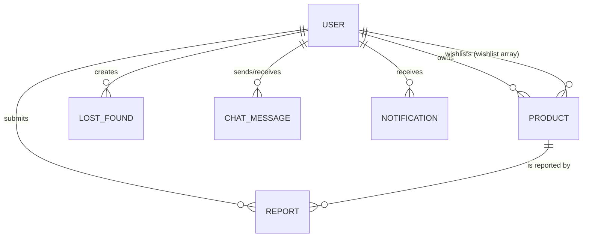

# Database Architecture & Schemas

Hostel Trade utilizes a **MongoDB** database, configured and queried via **Mongoose ODM** (Object Document Mapper).

---

## 1. Entity-Relationship (ER) Diagram

The relationships between collections are shown below:

---

## 2. Collection Schemas

### 1. User Collection (`User.js`)
Stores account credentials, profile pictures, hostel addresses, and student verification statuses.

- **Fields**:
  - `_id`: `ObjectId` (Primary Key)
  - `name`: `String` (Required, trim)
  - `email`: `String` (Required, Unique, verified against RegExp: `/^\w+([\.-]?\w+)*@\w+([\.-]?\w+)*(\.\w{2,3})+$/`)
  - `password`: `String` (Required, Minimum length 8, `select: false` to omit by default)
  - `role`: `String` (Enum: `['user', 'admin', 'student']`, Default: `'user'`)
  - `verified`: `Boolean` (Default: `false` - student approval switch)
  - `hostel`: `String` (Default: `""`)
  - `profilePicture`: `String` (Default: `"uploads/default-avatar.png"`)
  - `wishlist`: Array of `ObjectId` references to `Product` documents
  - `resetPasswordToken`: `String` (Hashed recovery token)
  - `resetPasswordExpire`: `Date` (Recovery token expiration time)
  - `createdAt` / `updatedAt`: `Date` (Timestamps auto-managed by Mongoose)
- **Indexes**:
  - `{ hostel: 1 }`: Optimized lookups for hostel-based user lists.
- **Mongoose Hooks**:
  - `pre('save')`: Hashes password using `bcrypt` (10 rounds) before inserting or modifying the password field.
- **Instance Methods**:
  - `matchPassword(enteredPassword)`: Compares candidate passwords with hashed database credentials.

---

### 2. Product Collection (`Product.js`)
Stores product details, stock, pricing, and intent (Buy/Rent).

- **Fields**:
  - `_id`: `ObjectId` (Primary Key)
  - `name`: `String` (Required, trim)
  - `category`: `String` (Required, Enum: `["Electronics", "Books", "Electrical", "Vehicles", "Miscellaneous"]`)
  - `description`: `String` (Default: `""`)
  - `price`: `Number` (Required, Minimum limit: `0`)
  - `images`: Array of `String` urls (Default: `[]`)
  - `stock`: `Number` (Default: `0`)
  - `intent`: `String` (Required, Enum: `["Rent", "Buy"]`)
  - `user`: `ObjectId` reference to `User` (Required, seller owner)
  - `status`: `String` (Enum: `["Available", "Sold"]`, Default: `"Available"`)
  - `createdAt` / `updatedAt`: `Date` (Timestamps auto-managed by Mongoose)
- **Indexes**:
  - `{ category: 1 }`: Fast category filter.
  - `{ price: 1 }`: Optimized price range query sorting.
  - `{ user: 1 }`: Quick seller-profile item retrieval.
  - `{ createdAt: -1 }`: Feeds marketplace listing sort-by-newest queries.
  - `{ name: "text", description: "text" }`: Full-text index support for search terms.

---

### 3. Lost & Found Collection (`LostFound.js`)
Stores lost/found item reports, locations, dates, and contact preferences.

- **Fields**:
  - `_id`: `ObjectId` (Primary Key)
  - `title`: `String` (Required, trim)
  - `description`: `String` (Required, trim)
  - `type`: `String` (Required, Enum: `["Lost", "Found"]`)
  - `category`: `String` (Required, Enum: `["Electronics", "Books", "Documents", "Keys", "Clothing", "Accessories", "Miscellaneous"]`)
  - `images`: Array of `String` urls (Default: `[]`)
  - `location`: `String` (Required, location lost/found)
  - `hostel`: `String` (Required, campus hostel hall)
  - `dateLostOrFound`: `Date` (Required, date of event)
  - `contactPreference`: `String` (Required, Enum: `["Chat", "Email", "Phone"]`, Default: `"Chat"`)
  - `reward`: `Number` (Minimum limit: `0`)
  - `status`: `String` (Required, Enum: `["Open", "Claimed", "Closed"]`, Default: `"Open"`)
  - `createdBy`: `ObjectId` reference to `User` (Required, poster)
  - `createdAt` / `updatedAt`: `Date` (Timestamps auto-managed by Mongoose)
- **Indexes**:
  - `{ category: 1 }`
  - `{ hostel: 1 }`
  - `{ type: 1 }`
  - `{ status: 1 }`
  - `{ createdAt: -1 }`

---

### 4. Chat Message Collection (`ChatMessage.js`)
Persists individual chat logs.

- **Fields**:
  - `_id`: `ObjectId`
  - `conversationId`: `String` (Required, format: `<user_id_1>-<user_id_2>` alphabetically sorted)
  - `sender`: `ObjectId` reference to `User` (Required)
  - `receiver`: `ObjectId` reference to `User` (Required)
  - `message`: `String` (Required)
  - `read`: `Boolean` (Default: `false`)
  - `createdAt` / `updatedAt`: `Date` (Timestamps)
- **Indexes**:
  - `{ conversationId: 1 }`: Speeds up conversation window loading.
  - `{ sender: 1, receiver: 1 }`: Speeds up checking user transaction flows.

---

### 5. Notification Collection (`Notification.js`)
Keeps track of real-time alerts pushed to active students.

- **Fields**:
  - `_id`: `ObjectId`
  - `user`: `ObjectId` reference to `User` (Required, target receiver)
  - `type`: `String` (Required, Enum: `["message", "listing_sold", "wishlist_update", "account_update"]`)
  - `title`: `String` (Required)
  - `content`: `String` (Required)
  - `read`: `Boolean` (Default: `false`)
  - `link`: `String` (Default: `""`, redirect paths for UI clicks)
  - `createdAt` / `updatedAt`: `Date` (Timestamps)
- **Indexes**:
  - `{ user: 1, createdAt: -1 }`: Fast retrieval of user notifications.

---

### 6. Report Collection (`Report.js`)
Persists listings flagged by students for administrative review.

- **Fields**:
  - `_id`: `ObjectId`
  - `reporter`: `ObjectId` reference to `User` (Required, flagging user)
  - `product`: `ObjectId` reference to `Product` (Required, flagged item)
  - `reason`: `String` (Required)
  - `status`: `String` (Enum: `["Pending", "Resolved"]`, Default: `"Pending"`)
  - `createdAt` / `updatedAt`: `Date` (Timestamps)
- **Indexes**:
  - `{ product: 1 }`: Optimized lookups for moderators checking product reports.
