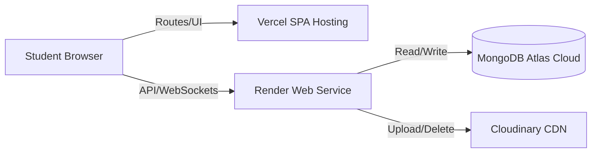

# Cloud Deployment & Infrastructure Configuration

This document explains the production deployment setup for **Hostel Trade** across MongoDB Atlas, Render, Vercel, and Cloudinary.

---

## 1. Production Topology

The application is deployed using a decoupled, serverless-friendly model:



---

## 2. Infrastructure Setup & Steps

### 1. Database (MongoDB Atlas)
1. Register/Login to [MongoDB Atlas](https://www.mongodb.com/cloud/atlas).
2. Create a Shared Cluster (M0 tier is sufficient).
3. Under **Network Access**, add IP address whitelist `0.0.0.0/0` (required for Render serverless servers).
4. Under **Database Access**, create a user account with read/write privileges.
5. Copy the connection URI:
   `mongodb+srv://<username>:<password>@cluster0.mongodb.net/hostel-trade?retryWrites=true&w=majority`

---

### 2. Media Storage (Cloudinary)
1. Register/Login to [Cloudinary](https://cloudinary.com).
2. Navigate to your Dashboard and retrieve the:
   * **Cloud Name**
   * **API Key**
   * **API Secret**
3. Create an upload folder named `hostel-trade` to structure your media files.

---

### 3. Backend Hosting (Render)
1. Register/Login to [Render](https://render.com).
2. Click **New** $\to$ **Web Service**.
3. Link your git repository.
4. Configure the Web Service:
   * **Name**: `hostel-trade-api`
   * **Environment**: `Node`
   * **Build Command**: `npm install` (inside the `backend` subdirectory)
   * **Start Command**: `node server.js`
5. In the **Environment Variables** tab, add:
   * `PORT`: `10000` (Render binds this port automatically)
   * `NODE_ENV`: `production`
   * `MONGO_URI`: *[Your MongoDB Atlas URI]*
   * `JWT_SECRET`: *[A secure, randomly generated key]*
   * `CLOUDINARY_CLOUD_NAME`: *[Cloudinary Cloud Name]*
   * `CLOUDINARY_API_KEY`: *[Cloudinary API Key]*
   * `CLOUDINARY_API_SECRET`: *[Cloudinary API Secret]*
   * `SMPT_HOST`, `SMPT_PORT`, `SMPT_USER`, `SMPT_PASSWORD`: *[Your SMTP server configuration]*

---

### 4. Frontend Hosting (Vercel)
1. Register/Login to [Vercel](https://vercel.com).
2. Click **Add New** $\to$ **Project** and import your git repository.
3. Configure the Project:
   * **Framework Preset**: `Vite`
   * **Root Directory**: `frontend`
   * **Build Command**: `npm run build`
   * **Output Directory**: `dist`
4. Set the **Environment Variables**:
   * `VITE_SERVER_URL`: *[Your Render Web Service URL]* (e.g. `https://hostel-trade-api.onrender.com`)
5. Deploy the project.
6. Configure the `vercel.json` file inside the `frontend/` directory to redirect all client routes to `index.html` for proper React Router handling:
   ```json
   {
     "rewrites": [
       { "source": "/(.*)", "destination": "/index.html" }
     ]
   }
   ```

---

## 3. Production Configurations

### CORS Origin Validation
The backend dynamically allows CORS origins in production, ensuring it matches your Vercel deployment URL:
```javascript
app.use(cors({
  origin: (origin, callback) => {
    // Allows Vercel app links and reflects local dev links
    callback(null, origin || true);
  },
  methods: ['GET', 'POST', 'PUT', 'PATCH', 'DELETE', 'OPTIONS'],
  allowedHeaders: ['Content-Type', 'Authorization'],
  credentials: true,
  exposedHeaders: ['Set-Cookie']
}));
```

### Axios Defaults Config (`authSlice.js`)
On initial load, the client configuration dynamically updates to target either localhost or the production Render domain, keeping the configuration flexible:
```javascript
const apiHostname = window.location.hostname === 'localhost' || window.location.hostname === '127.0.0.1'
  ? 'localhost'
  : window.location.hostname;
axios.defaults.baseURL = `http://${apiHostname}:5000`; // Dynamic fallback
```
> [!NOTE]
> In production environments, replace the fallback string with `import.meta.env.VITE_SERVER_URL` to ensure API requests are correctly routed to the production Render host.
