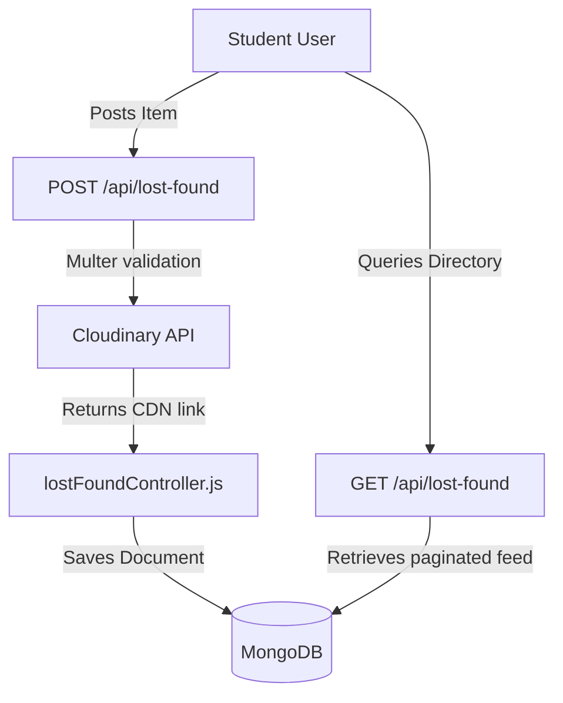

# Lost & Found System Architecture & Workflows

This document explains the implementation of the **Lost & Found** directory in **Hostel Trade**, including schemas, workflows, and frontend components.

---

## 1. Feature Architecture

The Lost & Found system is separate from the product marketplace. It uses its own collection (`LostFound.js`), controllers (`lostFoundController.js`), and routes (`lostFoundRoutes.js`).



---

## 2. Schema Blueprint (`models/LostFound.js`)
Refer to `docs/Database.md` for the complete Mongoose schema. Key fields include:
- `type`: `Lost` or `Found` (identifies the type of post).
- `location`: Specific place on campus where the item was lost or found.
- `hostel`: Hostel hall associated with the post.
- `contactPreference`: How the poster wants to be contacted (`Chat`, `Email`, or `Phone`).
- `reward`: Optional monetary reward.
- `status`: `Open` (default), `Claimed`, or `Closed`.

---

## 3. Workflows & Controllers

### 1. Creation Workflow
- Students open `/lost-found/create` and fill out the details (title, description, location, hostel, date, contact preference, reward, type, and optional images).
- The request is validated by `lostFoundValidator` and processed by Multer. Images are uploaded to Cloudinary, and the post document is saved to the database.

---

### 2. Search, Filters, and Sorting
The `/api/lost-found` route supports the following filters:
- **Search**: Escapes input using `escapeRegex` and searches across title, description, category, hostel, and location.
- **Type**: Filters by `Lost` or `Found`.
- **Status**: Filters by `Open`, `Claimed`, or `Closed`.
- **Sorting**: Matches sorting parameters:
  - `date_asc`: Sorts by `dateLostOrFound` ascending (oldest events first).
  - `date_desc`: Sorts by `dateLostOrFound` descending (recent events first).
  - `recently_added`: Sorts by `createdAt` descending (default).
- **Pagination**: Implements skip-limit logic:
  ```javascript
  const skip = (Number(page) - 1) * Number(limit);
  ```

---

### 3. Detail Views & Related Recommendations
When a user clicks on a post, the `getLostFoundById` controller returns the post details and populates the creator's profile details. It also queries the database to recommend up to 3 related posts matching the category or hostel:
```javascript
const relatedItems = await LostFound.find({
  _id: { $ne: item._id },
  $or: [{ category: item.category }, { hostel: item.hostel }],
}).limit(3).populate("createdBy", "name email hostel profilePicture");
```

---

### 4. Status Management (Toggling)
Post owners can update their post details or mark them as claimed or closed:
- **Claimed**: Item has been returned to its owner.
- **Closed**: Post is closed and no longer active.
- **Route**: `PUT /api/lost-found/:id` (checks if the user is the owner).
- **Deletion**: Poster can delete their post, which also removes the associated images from Cloudinary.

---

## 4. UI Components

* **`LostFoundPage.jsx`**: Displays a search bar, filter tags, and a paginated list of lost/found items.
* **`LostFoundCard.jsx`**: Renders item details, including type tags (red for "Lost", green for "Found"), reward badges, location info, dates, and status tags ("Open", "Claimed", "Closed").
* **`LostFoundDetailsPage.jsx`**: Shows the full details of a post, including the item image, poster details, contact buttons, and a list of related posts.
* **`CreateLostFoundPost.jsx`**: The form used to publish new posts, complete with validation checks.
