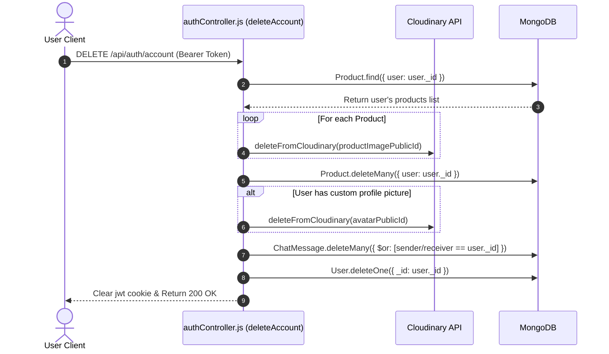

# User Profile & Account Lifecycles

This document describes the implementation of the **User Profile** page and account lifecycle management in **Hostel Trade**.

---

## 1. Updating Profile Information

### 1. Text Details (`updateProfile`)
* **Route**: `PUT /api/auth/profile`
* **Validation**: `profileUpdateValidator` (validates character limits for name and ensures the hostel field is not empty).
* **Logic**: Updates the user's name and hostel location in the database. Returns the updated user document to the client, which updates the Redux store and the `userInfo` object in localStorage.

---

### 2. Profile Picture Upload (`updateAvatar`)
* **Route**: `PUT /api/auth/avatar`
* **Validation**: Multer checks that the uploaded file matches image MIME types and limits size to 5MB.
* **Logic**:
  - Uploads the new image file to Cloudinary and retrieves the secure URL.
  - If the user has a custom profile picture (i.e. not the default avatar), it extracts the old image's public ID and calls `deleteFromCloudinary` to delete the old image file.
  - Updates the user's `profilePicture` field in the database with the new URL.

---

### 3. Password Changes (`changePassword`)
* **Route**: `PUT /api/auth/password`
* **Validation**: `changePasswordValidator` (requires both current and new passwords, and checks password strength requirements).
* **Logic**:
  - Finds the logged-in user and includes the password field:
    ```javascript
    const user = await User.findById(req.user._id).select("+password");
    ```
  - Verifies the current password using `user.matchPassword(currentPassword)`. Returns `401 Unauthorized` if validation fails.
  - Updates the password field with the new password. The User schema's `pre-save` hook automatically hashes the new password before saving the document.

---

## 2. Personal Listings Management (My Listings)

Sellers can manage their listings on the `/dashboard` page (`MyProducts.jsx` component):
* **My Listings**: Queries `/api/products` using the user's ID to fetch and display their active listings.
* **Status Updates**: Toggles listing status between "Available" and "Sold".
* **Listing Renewals**: Refreshes listing dates to bump items back to the top of search feeds.
* **Lost & Found Posts**: Displays personal lost/found posts on the profile page, allowing users to update their status (Open, Claimed, Closed) or delete them.

---

## 3. Account Deletion Cascade

Account deletion triggers a cascading cleanup to remove all database records and files associated with the user, ensuring system cleanliness and data privacy:


