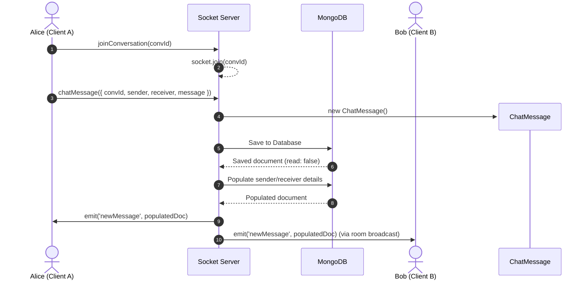

# Real-Time WebSocket Communication with Socket.io

Real-time negotiation, typing indicators, read receipts, and online status lists are powered by **Socket.io** integrated directly into the Node.js HTTP server.

---

## 1. Socket server initialization (`server.js`)

The Socket.io server is wrapped around the Node HTTP server. It reflects client origins dynamically to support local network and cross-domain handshakes:

```javascript
const io = new Server(server, {
  cors: {
    origin: (origin, callback) => {
      callback(null, origin || true);
    },
    methods: ['GET', 'POST', 'PUT', 'PATCH', 'DELETE', 'OPTIONS'],
    credentials: true
  }
});
```

---

## 2. Event Registry

The table below catalogs the custom Socket events passing between client and server:

| Event Name | Direction | Payload Structure | Description |
| :--- | :--- | :--- | :--- |
| **`registerUser`** | Client $\to$ Server | `userId` (string) | Registers user online and maps socket ID |
| **`onlineUsersList`**| Server $\to$ Client | `Array<userId>` | Broadcasts list of all active online user IDs |
| **`joinConversation`**| Client $\to$ Server | `conversationId` (string) | Joins target chat room channel |
| **`chatMessage`** | Client $\to$ Server | `{ conversationId, sender, receiver, message }` | Dispatches new chat message |
| **`newMessage`** | Server $\to$ Client | Populated message document object | Relays new message to room participants |
| **`typing`** | Client $\to$ Server | `{ conversationId, userId }` | Emits active typing trigger |
| **`stopTyping`** | Client $\to$ Server | `{ conversationId, userId }` | Emits typing timeout trigger |
| **`typingStatus`** | Server $\to$ Client | `{ userId, isTyping }` | Relays typing states to target room |
| **`markAsRead`** | Client $\to$ Server | `{ conversationId, userId }` | Marks unread messages as read |
| **`messagesRead`** | Server $\to$ Client | `{ conversationId, readerId }` | Relays read confirmation states to sender |
| **`errorMessage`** | Server $\to$ Client | `message` (string) | Relays server errors back to the client |
| **`disconnect`** | Server $\to$ Client | *(System trigger)* | Destroys mapping and broadcasts updated online list |

---

## 3. Real-Time Workflows

### 1. Online Presence Mapping
The server maintains an in-memory presence directory:

```javascript
const onlineUsers = new Map(); // userId -> Set of socket.ids
```

- When a client registers (`registerUser`), their `userId` is mapped to their socket ID. If it's a new connection, the updated online user list is broadcasted to all connected clients using `io.emit('onlineUsersList', ...)`.
- On disconnect, the socket ID is removed from the user's connection set. If no active connections remain for that `userId`, it is deleted from the `onlineUsers` map and an updated online list is broadcasted.

---

### 2. Messaging & Room Allocation
Conversations are routed through virtual rooms named after the alphabetical sort of the participant IDs (`userId1-userId2`):



---

### 3. Typing Indicators
Typing indicators are client-side actions triggered by keystrokes, which are then relayed to other room participants:

- **Keystroke Trigger**: When typing, the client emits `typing`. The server catches the event and broadcasts `typingStatus` with `isTyping: true` to other sockets in the room.
- **Inactivity Timeout**: The client uses a 2-second debounce timer. If no keystrokes are registered within 2 seconds, the client emits `stopTyping` and the server broadcasts `typingStatus` with `isTyping: false`.
- **Message Dispatched**: Sending a message clears the timer and immediately emits `stopTyping` to remove the indicator.

---

### 4. Read Receipts
Read receipts are synced in real-time between the database and the chat interface:

- **Chat Opened**: When a student opens a conversation, the client makes an HTTP request to mark messages in the database as read, and emits `markAsRead` via the socket.
- **Real-Time Notification**: The server updates all unread messages received by the user in that conversation to `read: true`, and broadcasts `messagesRead` to the room. The sender's client then updates their UI checklist icons from single grey ticks to double green ticks.
